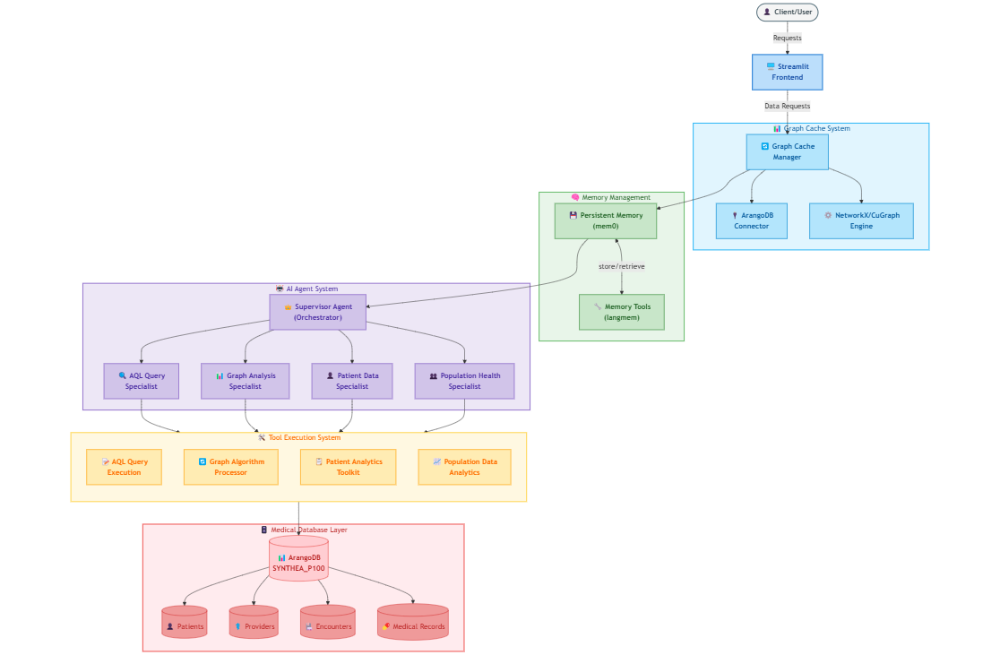

# MediGraph Consilium

## Overview

MediGraph Consilium is an advanced medical graph analysis platform that leverages AI agents to extract insights from healthcare data. The application provides a user-friendly interface to interact with a supervisor agent and four specialized AI agents for medical graph data analysis:

1. **Supervisor Agent** 🤖 - Coordinates between specialized agents to provide comprehensive answers
2. **AQL Query Agent** 🔍 - Expert in converting natural language to ArangoDB queries
3. **Graph Analysis Agent** 📊 - Specialist in medical network analysis using graph algorithms
4. **Patient Data Agent** 👤 - Focused on individual patient analysis and history
5. **Population Health Agent** 👥 - Analyzes trends across large patient populations

Each agent has specific capabilities and tools designed for different aspects of medical data analysis.

## System Architecture



```
┌─────────────────────────────────────────────────────────────────────────┐
│                        MediGraph Consilium                               │
│                                                                         │
│  ┌─────────────────────────────────────────────────────────────────┐    │
│  │                      Streamlit Web Interface                     │    │
│  └─────────────────────────────────────────────────────────────────┘    │
│                                  │                                       │
│  ┌─────────────────────────────────────────────────────────────────┐    │
│  │                       Graph Cache System                        │    │
│  │  ┌───────────────┐  ┌───────────────┐  ┌───────────────────┐    │    │
│  │  │ ArangoDB Conn │  │NetworkXCuGraph│  │ ArangoGraph Object│    │    │
│  │  └───────────────┘  └───────────────┘  └───────────────────┘    │    │
│  └─────────────────────────────────────────────────────────────────┘    │
│                                  │                                       │
│  ┌─────────────────────────────────────────────────────────────────┐    │
│  │                     Memory Management System                     │    │
│  │  ┌───────────────┐  ┌───────────────┐                           │    │
│  │  │  mem0 Memory  │  │    langmem    │                           │    │
│  │  └───────────────┘  └───────────────┘                           │    │
│  └─────────────────────────────────────────────────────────────────┘    │
│                                  │                                       │
│  ┌─────────────────────────────────────────────────────────────────┐    │
│  │                        Agent Orchestration                       │    │
│  │                                                                  │    │
│  │  ┌───────────────────────────────────────────────────────────┐  │    │
│  │  │                     Supervisor Agent                       │  │    │
│  │  └───────────────────────────────────────────────────────────┘  │    │
│  │                              │                                   │    │
│  │  ┌──────────┬──────────┬────────────┬────────────────────────┐  │    │
│  │  │          │          │            │                        │  │    │
│  │  ▼          ▼          ▼            ▼                        ▼  │    │
│  │┌─────────┐┌─────────┐┌──────────┐┌────────────┐  ┌─────────────┐│    │
│  ││   AQL   ││  Graph  ││ Patient  ││ Population │  │ Additional  ││    │
│  ││  Agent  ││  Agent  ││  Agent   ││   Agent    │  │   Agents    ││    │
│  │└─────────┘└─────────┘└──────────┘└────────────┘  └─────────────┘│    │
│  └─────────────────────────────────────────────────────────────────┘    │
│                                  │                                       │
│  ┌─────────────────────────────────────────────────────────────────┐    │
│  │                         Tool Execution                          │    │
│  │  ┌───────────┐ ┌────────────┐ ┌────────────┐ ┌───────────────┐  │    │
│  │  │AQL Queries│ │Graph Algos │ │Patient Data│ │Population Data│  │    │
│  │  └───────────┘ └────────────┘ └────────────┘ └───────────────┘  │    │
│  └─────────────────────────────────────────────────────────────────┘    │
│                                  │                                       │
│  ┌─────────────────────────────────────────────────────────────────┐    │
│  │                      ArangoDB Database                          │    │
│  │  ┌───────────────────────────────────────────────────────────┐  │    │
│  │  │                    SYNTHEA_P100 Graph                     │  │    │
│  │  │  ┌─────────┐  ┌─────────┐  ┌─────────┐  ┌─────────────┐   │  │    │
│  │  │  │Patients │  │Providers│  │Encounters│  │Other Medical│   │  │    │
│  │  │  │         │  │         │  │          │  │Collections   │   │  │    │
│  │  │  └─────────┘  └─────────┘  └─────────┘  └─────────────┘   │  │    │
│  │  └───────────────────────────────────────────────────────────┘  │    │
│  └─────────────────────────────────────────────────────────────────┘    │
└─────────────────────────────────────────────────────────────────────────┘
```


## Environment Setup

### Environment Variables

The application uses environment variables for configuration. These are stored in a `.env` file in the project root. 

A template file `.env_example` is provided. To set up your environment:

1. Copy `.env_example` to `.env`:
   ```bash
   cp .env_example .env
   ```
2. Edit the `.env` file with your actual credentials:
   ```
   # ArangoDB Credentials
   ARANGO_HOST=your_arango_host_url
   ARANGO_USERNAME=your_username
   ARANGO_PASSWORD=your_password
   ARANGO_DB=your_database_name
   ARANGO_VERIFY=True

   # OpenAI API Key
   OPENAI_API_KEY=your_openai_api_key

   # Graph Cache Settings
   CACHE_TTL=3600  # Cache time-to-live in seconds (1 hour)

   # Graph Settings
   GRAPH_NAME=SYNTHEA_P100
   DEFAULT_NODE_TYPE=allergies
   ```

The application will load these environment variables using the `settings.py` module. If the `.env` file is not present, default values will be used where available, but the application may not function correctly without valid credentials.

## Key Features

- **Intuitive UI**: Clean, card-based interface for selecting agents
- **Chat Interface**: Natural conversation with each specialized agent
- **Streaming Responses**: See agent responses as they're generated
- **Debug Mode**: Option to view intermediate steps and reasoning
- **Persistent Chat History**: Conversations are saved between sessions
- **Graph Caching**: Optimized performance with intelligent graph database caching
- **Multi-Agent Orchestration**: Supervisor agent coordinates between specialized agents
- **Real-time Progress Tracking**: Visual progress indicators for long-running operations

## Graph Caching System

MediGraph Consilium implements an intelligent graph caching system that significantly improves performance:

- **Single Load**: The graph database is loaded only once when the application starts
- **Memory Efficiency**: Only one copy of the graph is kept in memory, shared across all agents
- **Cache Management**: Users can view when the graph was last loaded and manually refresh if needed
- **Automatic Refresh**: The cache automatically refreshes after a configurable time period (default: 1 hour)
- **Performance Metrics**: Loading time and cache status are tracked and displayed

## Memory Management System

MediGraph Consilium uses a sophisticated memory management system to provide agents with context from previous conversations:

- **mem0**: Provides persistent memory storage for agent conversations
- **langmem**: Offers memory tools for agents to store and retrieve information
- **User-specific Memory**: Each user has a dedicated memory space identified by mem0_user_id
- **Agent-specific Memory**: Each agent maintains its own memory context
- **Semantic Search**: Agents can search for relevant information from past conversations
- **Memory Management Tools**: Agents can manage their memory with specialized tools

## Data Flow

1. **User Input**: User submits a medical query through the Streamlit interface
2. **Agent Selection**: Query is routed to the appropriate agent (or supervisor)
3. **Graph Access**: Agent accesses the cached graph data through the graph cache system
4. **Query Processing**: Agent processes the query using specialized tools
5. **Response Generation**: Results are formatted and returned to the user interface
6. **Visualization**: Data is presented in a user-friendly format with optional debug information

## Installation

1. Ensure you have Python 3.8+ installed
2. Clone this repository
3. Install the required dependencies:

```bash
pip install -r requirements.txt
```

4. Set up your environment variables:
```bash
cp .env_example .env
```

5. Edit the `.env` file with your actual credentials

## Running the Application

To start MediGraph Consilium:

```bash
cd arangodb-cugraph
streamlit run agent_hub_app.py
```

The application will open in your default web browser at `http://localhost:8501`.

## Usage

### Home Page
- Select an agent by clicking on its card or the "Chat with..." button
- View the graph cache status and refresh if needed from the sidebar

### Agent Page
   - Type your question in the chat input at the bottom
   - View the agent's response in the chat window
- Expand "Agent Thinking Process" to see the agent's reasoning
   - Use "Clear Chat History" to reset the conversation
- Return home by clicking the "← Back to Agent Hub" button

## Example Queries

### Supervisor Agent
- "What are the most common treatments for patients with diabetes?"
- "Find connections between heart disease and specific medications"

### AQL Query Agent
- "What is the average age of patients in the database?"
- "Find all patients diagnosed with diabetes in the last year"

### Graph Analysis Agent
- "Find the most central providers in the healthcare network"
- "Identify communities of related conditions in the medical graph"

### Patient Data Agent
- "Give me a complete medical history for patient with ID '7c2e78bd-52cf-1fce-acc3-0ddd93104abe'"
- "Compare treatment outcomes for this patient with similar patients"

### Population Health Agent
- "What are the most common conditions in the database and their frequencies?"
- "Analyze the effectiveness of different medications for hypertension"

## Technical Details

The application uses:
- **Streamlit**: For the web interface
- **LangChain and LangGraph**: For agent orchestration
- **ArangoDB**: For the medical graph database
- **NetworkXCuGraph**: For graph analysis algorithms
- **OpenAI's models**: For natural language processing
- **mem0**: For persistent memory management
- **langmem**: For agent memory tools
- **Custom Caching System**: For optimized graph database performance

## How the Supervisor Agent Works

The supervisor agent uses the `langgraph_supervisor` package to create a workflow that:

1. Analyzes the user's question to determine its nature and requirements
2. Selects the most appropriate specialized agent based on the question type
3. Routes the question to the selected agent
4. Returns the selected agent's response to the user

## Extending the System

To add new specialized agents to the supervisor:

1. Create a new agent module following the pattern of existing agents
2. Add the agent to the `create_specialized_agents()` function in supervisor_agent.py
3. Update the supervisor prompt to include information about the new agent
4. Add the agent to the agent_info dictionary in agent_hub_app.py

## Troubleshooting

If you encounter issues:

1. Ensure all dependencies are installed correctly
2. Check that ArangoDB is running and accessible
3. Verify that your OpenAI API key is set correctly in your environment
4. Check the console for error messages
5. If the graph fails to load, try using the "Refresh Graph Cache" button in the sidebar

## License

This project is licensed under the MIT License - see the LICENSE file for details. 